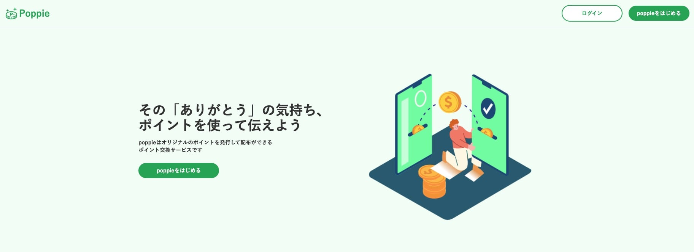
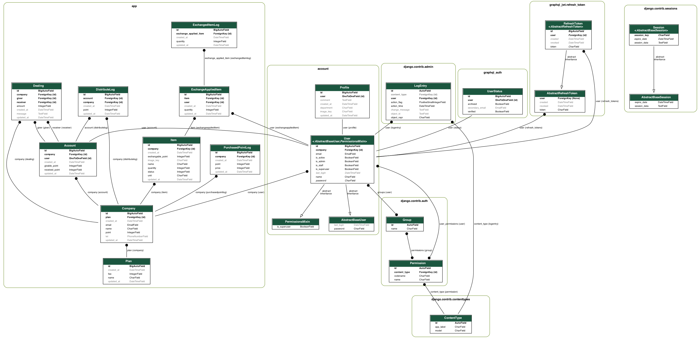

## サービス名
poppie  

## URL
https://poppie.site  
ログインする際は以下のテストアカウントをお使いください。  
メールアドレス: `test@test.com`  
パスワード: `poppie1234`  

## サービス概要
誰でもオリジナルのポイントを発行して配布ができるポイント交換サービスです。  
現在の仕様として企業が利用することを想定して設計しており、  
企業の管理者がpoppie内で使える独自のポイントを発行し、企業は従業員に対してポイントを配布することができます。  
従業員は他の従業員に対して感謝の意味を込めてポイントとをあげることができ、もらったポイントは企業が用意する景品と交換することができます。  

## 開発した目的
知り合いが仕事の中で同僚に助けてもらっていた際「何かあげたい」と言っていたのをヒントに、
誰でもオリジナルのポイントを発行して配布ができるサービス、poppieを開発しました。  
poppieを通して日頃の感謝の思いをポイントにして贈ることで、贈る人ともらう人の両方に喜んでもらえるサービスにしたいと思っています。  

## 使用技術
- Python 3.9
- Django 3.2.12
- React 17.0.2
- Next.js 12.1.0
- PostgreSQL 13.3
- GraphQL
- Tailwind CSS
- daisyUI
- Docker
- Terraform
- AWS(VPC, ELB, RDS(Postgres), ECR, ECS Fargate, Route53, IAM, ACM, CloudWatch)
- GitHub Actions

## 機能一覧
- 新規登録、ログイン機能
- ポイント交換機能
- ポイント交換履歴閲覧機能
- ポイント購入機能
- 景品作成・編集・交換機能
- グループ作成・編集機能

## 今後実装したい機能
- ポイント交換履歴分析機能
- 有料プラン用意、決済機能追加
- 社内で使えるクーポン等の景品提供機能
- 社内イベント等のお知らせ作成機能

## テスト
- フロントエンド
  - E2Eテスト(Cypress)
- バックエンド
  - ユニットテスト(pytest)
  - GraphQLクエリテスト(pytest)

## ER図

